# java-oauth2

java-oauth2 initial should be the same as java-usermodel - expections and logging

### server.port
* Default port 8080, otherwise defined in resources/application.properties.

### Logging
* Under Spring boot, slf4j and LogBack are treated the same. 
* Include slf4j as dependency in pom.xml, a file logback-spring.xml can be created to control loggging output to files and console.
* slf4j enables LoggerFactory to creater logger.info.In application.properties -> server.port=${PORT:2019}

### In eclipse Project Explorer,
* If spring boot starter web is managed by maven in pom.xml, tomcat will be managed by Spring boot.
* right click the project name -> select "Run As" -> "Maven Build..."
* In the goals, enter _> spring-boot:run
* then click Run button


* If tomcat is installed in pom.xml
* goals -> tomcat:run

## Oauth2 - default in the Spring Security module

> OAuth2 is an industry standard protocol for user authentication. User authentication is the verification of what human is accessing our system. Client applications request an access token from a backend API system. Gaining an access token allows a user to access projected resources, endpoints and allows the backend system to know who that user is without the user having to provide their username and password for each transaction. Gaining this access token is done through a two step process.

* Clients must be authorized to access the system using a client user name and password, called a client id and client secret in the OAuth2 protocol. This client id and client secret could be the same for all clients who want to access the backend API, or each client could receive their own id and secret. The ids and secrets are controlled by the backend system. The backend system must tell the client what client id and client secret to use!
   - Sometimes a client will send an authorization token instead of a client id and client secret. For our purposes, this authorization token is simply the client id and client secret combined and encoded using Base64 encoding.
* After a client has been authorized, an individual user is authenticated to the system using a user name and password.

> These two steps are necessary but are usually combined into a single request from the client for an access token. After initially getting the access token, the client must send that token with each subsequent request. The access token can be used by the backend system to determine what user is accessing the system.

In the OAuth2 framework, 4 Roles are identified.

* The client
   - Often called the frontend. This is the application that wishes to access our backend API server.
* The Resource Server
   - This is our backend API server. It is the server that hosts the protected information.
* The Authorization Server
   - This is the part of the backend application that grants access tokens. Access tokens are only granted after the client is authorized and the user is authenticated. When we think of using Google, Facebook, GitHub to logon to a system, what we mean is that we are using their authorization server to get an access token. 
* The Resource Owner
   - Usually a person that grant access to a protected resource. Think something like a system admin.
   
### Roles in our code
> We will be using Spring Security to implement OAuth2. OAuth2 is the default, standard protocol implemented by Spring Security. That will make implementation easier. The implement is a series of boilerplate code that is customized to fit our applications. We will be using

* An AuthorizationServerConfig class that will serve the role of the Authorization Server. We use the @EnableAuthorizationServer annotation to set up a default authorization server and then customize it to fit our applications.
* A ResourceServerConfig class that will serve the role of the resource server. We use the @EnableResourceServer annotation to set up a default resource server and then customize it to fit our application. Most of our application is concerned with how to protect, display, and manipulate resources. So most of our application, including all that we have coded up until this point, can be considered part of the resource server.
* A SecurityConfig class that will serve as the main configuration class for our OAuth2 server. We use the @EnableWebSecurity annotation to say, yes we want to use web security and then we configure this web security to our own needs.

> Do note that the OAuth2 process as authorization or authentication. This is not correct. Those are two different parts of the OAuth2 protocol. However, in the industry often the OAuth2 protocol is referred to as authorization or authentication.

### Gaining Access
> In order to request an access token, our client needs to know the client id and client secret. These will be provided to the client by the backend administrator. It is OUR responsibility to give the frontend the client id and client secret. The frontend client does not get to choose what these are, we do. Commonly you will see these being hard to guess random characters, normally 32 character hex strings. Sometimes you will see the client id and client security provided as Base64 API access tokens. A client would use either the client id / client security combination or the API access token to get authorized to the system. They do NOT use both. Which one they use is often left to the client to decide. The format of combining the client id and client secret is to take the following and encode it using Base64:

* client id:client secret

* Client id: 6779ef20e75817d76902 Client security: 9e51c1701e1a6f5cfb30780d94d38b8d API access token: Njc3OWVmMjBlNzU4MTdkNzY5MDI6OWU1MWMxNzAxZTFhNmY1Y2ZiMzA3ODBkOTRkMzhiOGQ=


> For our purposes we will use something easy to read. This will make reviewing each other’s code much easier.

* Client id: lambda-client Client security: lambda-secret API access token: bGFtYmRhLWNsaWVudDpsYW1iZGEtc2VjcmV0


### Adding a new user
> But before we can request access to the system, we need a user set up, you know, the one requesting access!

> Adding a new user is the same as adding any other record to our database. The one additional item is that the password has to be encrypted. Although not required, encrypting the password is definitely the preferred practice! We use an encryption algorithm called BCrypt. This is fairly standard in the industry.

> We say which algorithm we are going to use in the SecurityConfig class. This is where we setup the Bean for PasswordEncoder in SecurityConfig class.
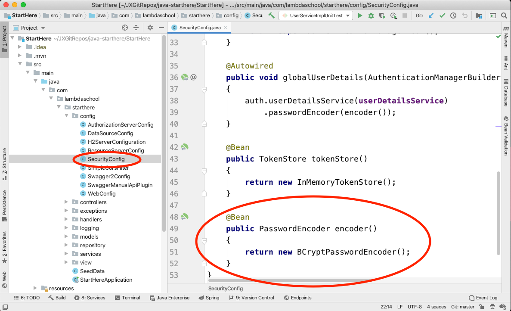

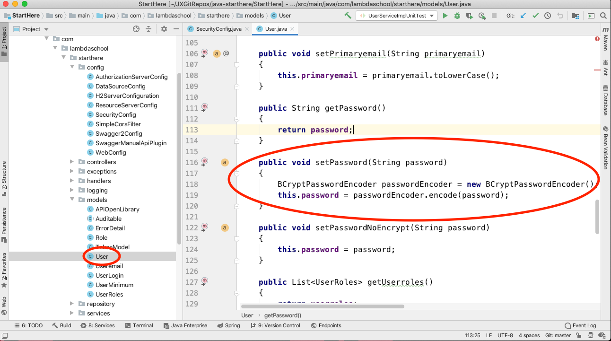

### Authorizing the client
> The step in using the API Backend is to Authorize the client, the application wanting to use the API. The client has a special username and password needed to access the backend. They also have special names.

* username => client id
* password => client secret

> These are sent to the API backend via the Authorization header in a REST API request. They can either be sent as a username and password, or as is more common an API Key. The API Key is simply the string client id:client secret encoded using Base64.

> The AuthorizationServerConfig class is responsible for handling the Authorization of the client.

* In our case we list the client id and client secret directly in the AuthorizationServerConfig allowing for only one client id, client secret combination. Some systems provide access to multiple client ids but that is a more advanced topic.
* Note that the client secret is also encrypted using BCrypt, using our encode Bean from the SecurityConfig class.
* Other configurations happen in the AuthorizationServerConfig like how long a token is valid.


* We also set what the login endpoint from where a user, not to be confused with the client, gets their authentication token.
    - Client is the fontend system accessing the API Backend
    - User is the person, usually, actually handling data from the Backend.
    
 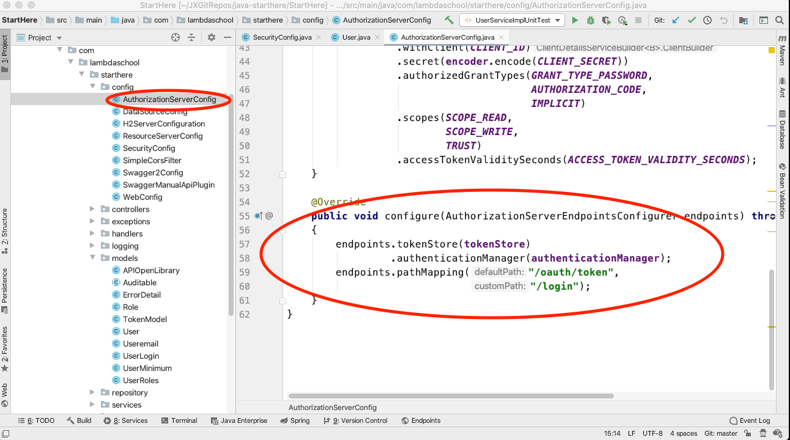
 
### Authenticating the user
> In most REST API calls from a client, the Authorization and Authentication are handled in a single request. The client just sends the client id and client secret along with a username and password to the API Backend System. That API Backend System takes care of Authorizing the client and then Authenticated the user!

> Authenticating a user happens after the client is Authorized. The client must have access to the API Backend System via its client id and client secret before it can request an Authentication token for a user.

> The process of Authentication is taking a username and password and determining if that combination is a valid combination, represents a valid user, of the system. If the validity of the user is confirmed, the API Backend System returns to the client an Authentication Token. It is this token that will identify the user in future requests.

> That Authentication Token is store in the Token Store. You can think of a Token Store as a table in memory with columns contains data such as

* The Authentication Token
* The time the token is to expire
* The Authentication object of the user, the UserDetails Security Object which is essentially a cached copy of the user record only containing data necessary for security.
* The Token Store Bean is set up in the SecurityConfig class and configured as the Authentication Manager in the AuthorizationServerConfig

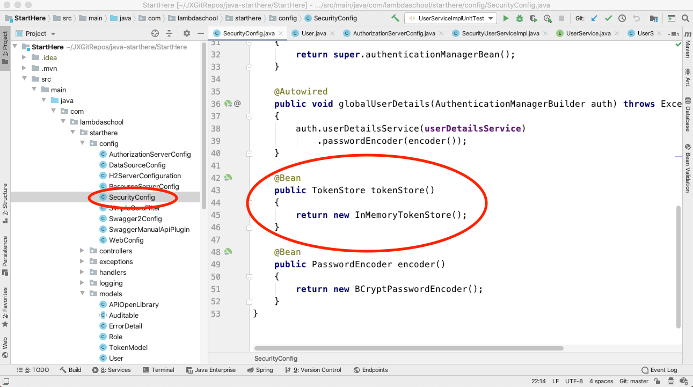

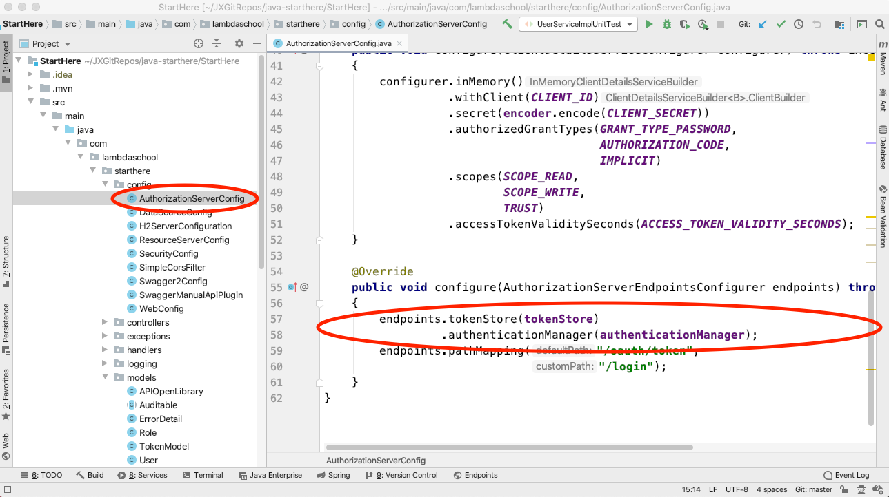

### Using the authentication token
> Note that we restrict what user can do what with our data through user roles. Users get access to read, manipulate certain pieces of data by what role they are assigned. Role assignment are often done by type of user: admin, dataentry, user. Sometimes departments are added: systemadim, accountingadmin, hrdataentry, manufacturinguser. The name of the role can be anything but is usually something that makes sense to a human reading the role title. Role titles do get hard coded in our applications when we are restricting data to certain roles. So name roles carefully as changing the name of role is a BIG deal!

> Now we have an authentication token that identifies that this is a valid user and identifies which user it is. From this authentication token we can also identify what can access.

> To access a restricted endpoint, the client send an authentication token in the Authorization header.

> Spring Framework looks for that authentication token in the TokenStore

* If Spring Security finds the token in the TokenStore
    - Spring Security sees if the user associated with this token has access to the requested endpoint.
       - This is handled through the getAuthority method in the User model
       - This method returns which “Authorities” the user has been granted. In our case, those authorities are equivalent to our roles.

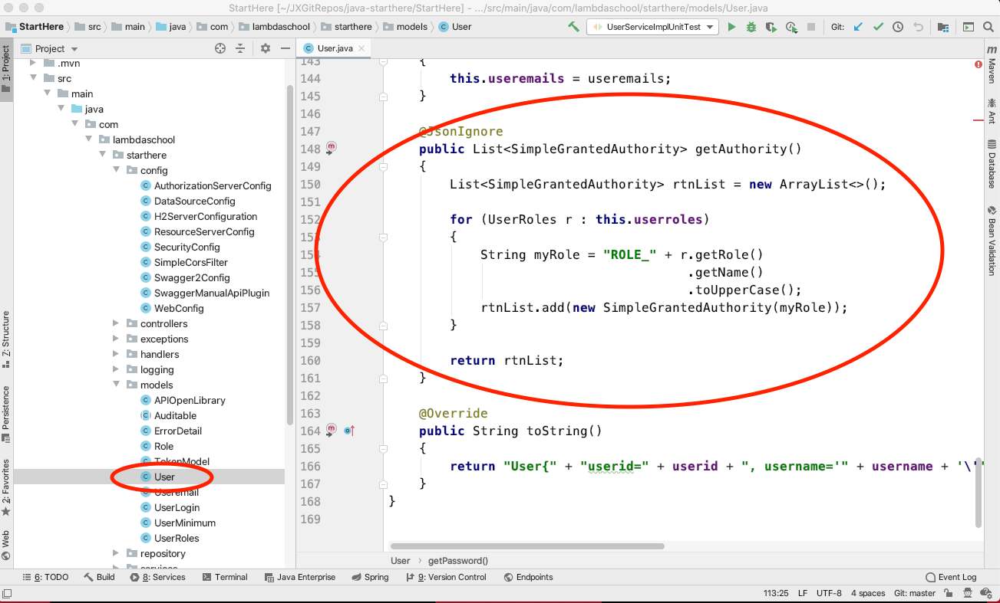

* If Spring Security does not find the token in the TokenStore, an unauthorized status is returned.

* To determine which roles has access to what endpoints, the first place to check is the ResourceServerConfig. This class determines which roles have access to which resources, or endpoints. The majority of your security configuration happens in this class.

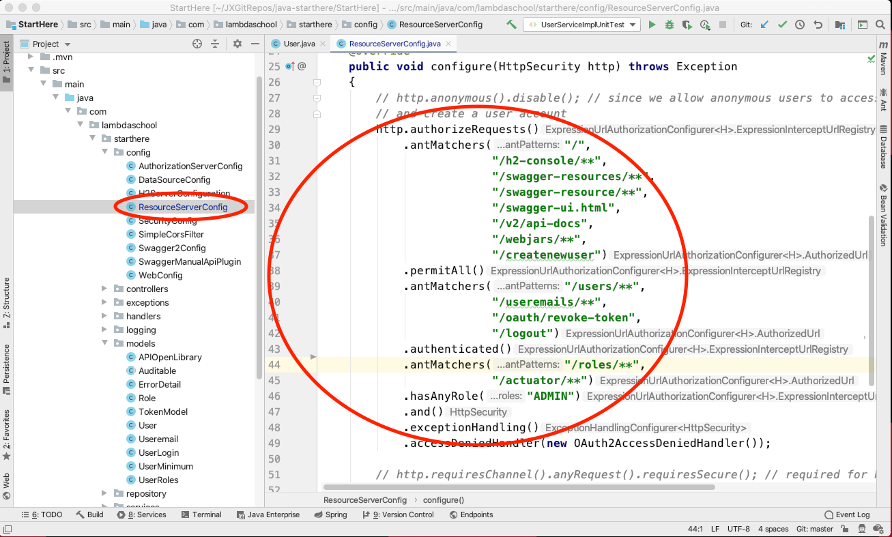

* You allow access to a resource using .antMatchers
* The parameter for .antMatcher is a regular expression stating which endpoints you want to restrict.
* The .antMatchers ends with a method
    - .permitAll() - allows access to all. No Authentication Token is necessary
    - .authenticated() - allows access to all authenticated users. A valid authentication token is required.
    - .hasAnyRole() - the parameter is a list of roles who have access to these endpoints.
* You can further restrict your security access using a @PreAuthorize annotation in the Controller. This further restrict access to this endpoint to only the given roles. Note: you cannot expand access via this method only further restrict it.

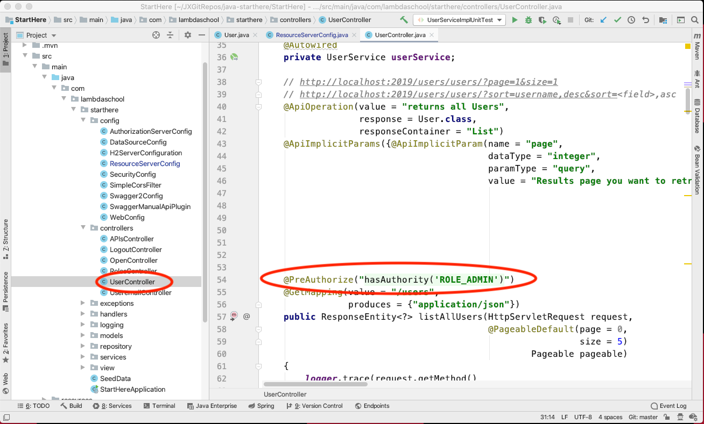

## POM.XML
> We need to tell our application that we will be using Spring Security. We do this by adding the appropriate dependencies to the POM.XML file. Once we add these dependencies to the POM.XML, we must implement security before we can run our application! So add the following dependencies to your POM.XML file. These dependencies can also be found in the security-boilerplate code directory
```java
 <!-- Security Dependencies Start -->
        <dependency>
            <groupId>org.springframework.boot</groupId>
            <artifactId>spring-boot-starter-security</artifactId>
        </dependency>

        <dependency>
            <groupId>org.springframework.security</groupId>
            <artifactId>spring-security-test</artifactId>
            <scope>test</scope>
        </dependency>

        <dependency>
            <groupId>org.springframework.security.oauth</groupId>
            <artifactId>spring-security-oauth2</artifactId>
            <version>2.3.6.RELEASE</version>
        </dependency>
        <!-- Security Dependencies End -->
 ```
 
### Necessary Models
> Our application relies on user names - which could be a name, an email, user id - user passwords, and user roles. We need a place to store this information in our application. For the current sample application, we are going to use a separate users table. The user table would normally not only hold our user names and passwords but also anything else that is needed for a user of the system. In our case, combining the users model and the employee model into one table would make sense.

> The roles will have a many-to-many relationship with users. A user can have multiple roles. A role should have multiple users.

* Users
    - In user we have a way to deal with passwords that are coming from the client not encrypted using the method setPassword(String password). When a password is internal to our system, it is encrypted. We can set an already encrypted password using the method setPasswordNoEncrypt(String password).
    - Users have an additional getAuthority() method. This is the method Spring Security will use to determine which roles a user has.
* Roles
    - Always keep role names all upper case. Experience shows this will make your life easier!
* UserRoles

> And of course we need to add the necessary Repositories to connect these models to the rest of our application. Again inside the security-boilerplate code add the repositories for

* UserRepository
* RoleRepository
    - We do not need one for UserRoles!

### Necessary Services
> We are going to keep our boilerplate simple and access the models through the repositories, bypassing services. This is for our example only. In a production system, USE SERVICES!!! However, Spring Security relies on a service that connects it to our User, Role models. From the boilerplate code, add the service SecurityUserServiceImpl.

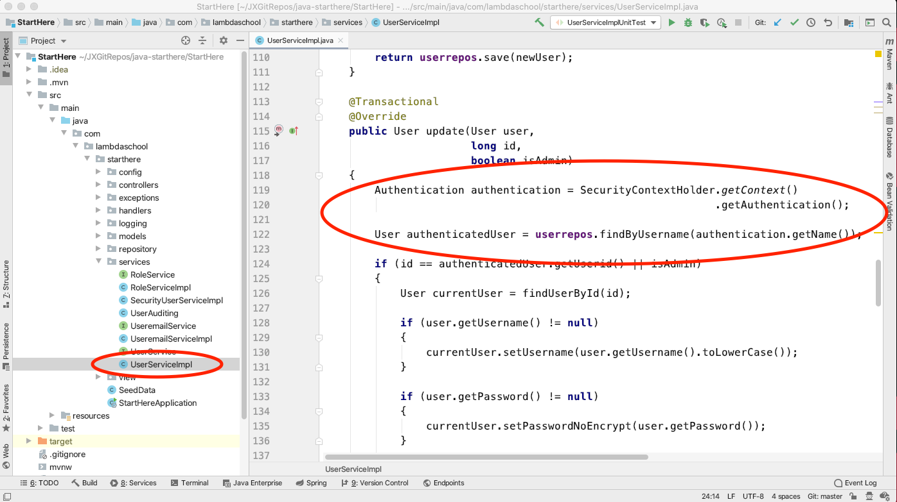

> Now that we have real user id, we need to update the UserAuditing service to use those user ids! Put the updated version of UserAuditing from the boilerplate code into your application.

### Json Web Token (JWT) vs Oauth2
> Unlike JSON Web Tokens (JWT), no information is included with the authentication token sent to the client. Security is the reason for this. If the token is intercepted during transmission, the interceptor just has the token and no additional information. In order to get additional information, the interceptor would have to query API Backend system, meaning they would have to be able to connect to the system - CORS and client access would have to be configured just right to let this happen.

* Positive is increased security
* Negative is increased web traffic and complexity for the client application

> You can determine the name of the user associated with the given authentication token using a variety of methods
    - Referencing the global class SecurityContextHolder

* From the global Authentication class, you can call the method getPrincipal() to learn a variety of information about the user and their authorities

* From the global Authentication class, you can call the method getName() to return the username. You can then call UserService.findByName() with that name as the parameter and return the entire user record associated with that authentication token.

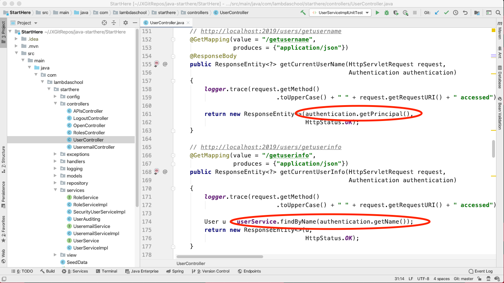

### Configuration
> Now for the part totally new related to Security. We are going to configure our web security, enable our authorization server, and enable our resource server.

> Work with web security first. Add the code from the boilerplate SecurityConfig to your application’s subpackage config. This configuration file

* Enables are authentication manager allowing us to work with the user names and passwords
* Connects Spring Security to the service SecurityUserServiceImpl and thus to our user and role tables
* Creates an in memory table to store and maintain the access tokens for our systems. This acts as a separate in memory database. It is in memory for speed of access and so when the system goes down, all access is reset. Users have to sign in again after a system restart.
* Defines the password encryption method we will use. Normally we will use the industry standard BCrypt as we do in this example.

> Now let’s enable our Authorization Service. Add the code from the boilerplate AuthorizationServerConfig to your application’s subpackage config. This configuration file

* Enables our authorization service using a client id and client secret it reads from the environment variables OAUTHCLIENTID and OAUTHCLIENTSECRET respectively.
* We will set the access token to be valid forever. We can set the access token to become invalid after a certain time period forcing a user to sign in to our system again.
* Besides using Roles, OAuth2 provides another layer of security rights called Scopes. We will not be addressing scopes in this module.
* The grant type password tells the authorization server that we will be using the standard user name and password model to authenticate. Other methods exist but this one is by far the most common!
* The default endpoint for requesting an access token in Spring Security is /oauth/token. We can easily change this to something like /login. The last method in the configuration class configure(AuthorizationServerEndpointsConfigurer endpoints) does this for us.

> Finally, let’s enable our Resource Service. Add the code from the boilerplate ResourceServerConfig to your application’s subpackage config. The main purpose of this configuration class is to say which roles have access to which methods and endpoints, what are roles allowed to do. This is done through a series of antMatchers which are used to configure the authorized requests in our system. The boilerplate contains a simple series of .antMatchers. We have two Roles, ADMIN and USER. USER has access to all endpoints starting with /employees. ADMIN has access to all endpoints starting with /users. Anyone using the system (.permitAll()) can access /createnewuser. Anyone who has authenticated to the system can access /logout.

> Note that in an antMatcher,
* /users means just that endpoint
* /users/** means the /users endpoint and anything below that. So for example
    - /users
    - /users/1
    - /users/roles/add/me
    
> Below is a more complex that shows some of the power of how we control endpoints in our application. This is adapted from the guided project for this module.
```java
// our antMatchers control which roles of users have access to which endpoints
        // we must order our antmatchers from most restrictive to least restrictive.
        // So restrict at method level before restricting at endpoint level.
        // permitAll = everyone and their brother
        // authenticated = any authenticated, signed in, user
        // hasAnyRole = must be authenticated and be assigned this role!
        http.authorizeRequests()
            .antMatchers("/",
                "/h2-console/**",
                "/swagger-resources/**",
                "/swagger-resource/**",
                "/swagger-ui.html",
                "/v2/api-docs",
                "/webjars/**",
                "/createnewuser")
            .permitAll()
            .antMatchers(HttpMethod.POST, "/users/**")
            .hasAnyRole("ADMIN")
            .antMatchers(HttpMethod.DELETE, "/users/**")
            .hasAnyRole("ADMIN")
            .antMatchers(HttpMethod.PUT, "/users/**")
            .hasAnyRole("ADMIN")
            .antMatchers("/users/**",
                "/useremails/**",
                "/oauth/revoke-token",
                "/logout")
            .authenticated()
            .antMatchers("/roles/**")
            .hasAnyRole("ADMIN")
            .and()
            .exceptionHandling()
            .accessDeniedHandler(new OAuth2AccessDeniedHandler());
```

> Note: they are called ant matcher from an old Apache Organization application called ant which was used for pattern matching. Ant = Another Neat Tool.

### Security is in place
> Thanks to the behind the scenes work of Spring Security, enabling OAuth2 security in Java Spring is simply adding a series of boilerplate code and configuring it to fit our application. We now have user authentication in place! We will see how to access this in the objective covering using Postman with User Authentication!


## CORS - Cross-Origin Resource Sharing
> We are using the same computer, as our frontend client - think Postman, as the one where our API backend system resides. Same computer, same domain, same “origin”. Soon we will be deploying our API to the cloud. Ultimately this is what we are after, making our API available to others. When we deploy, the client accessing our API and our API backend will most likely be on different computers, different domains, different “origin”. We need to allow different origins to share, use the resources of our API backend. By default only clients and backends running on the same system can access each other. We need to allow Cross-Origin Resource Sharing, normally called CORS.

> We allow CORS, also referred to as preventing CORS errors, we can specific

* Which origins, domains can access our API.
    - Normally we will allow all origins to access our API. This is certainly true of all publicly facing APIs. For company internal APIs, you may wish to restrict which origins can access the API to only those within the company
* Which HTTP Methods will be allowed
* Which Access Control Headers will be allowed

> We are going to allow all origins using any HTTP Methods and using any Access Control Headers. We do this by taking advantage of the Spring Filter Chain which filters who has access to what on our API.

```java
import org.springframework.core.Ordered;
import org.springframework.core.annotation.Order;
import org.springframework.http.HttpMethod;
import org.springframework.stereotype.Component;

import javax.servlet.Filter;
import javax.servlet.FilterChain;
import javax.servlet.ServletException;
import javax.servlet.ServletRequest;
import javax.servlet.ServletResponse;
import javax.servlet.http.HttpServletRequest;
import javax.servlet.http.HttpServletResponse;
import java.io.IOException;

/**
 * Spring uses filters to manage web traffic. Here we manually add a CORS (Cross-Origin Resource Sharing) filter to the chain.
 * Using the Order annotation, we tell Spring this is the most important filter. If this filter blocks a request,
 * don't do anything else. Just block the request.
 */
@Component
@Order(Ordered.HIGHEST_PRECEDENCE)
public class SimpleCorsFilter
    implements Filter
{
    @Override
    public void doFilter(
        ServletRequest servletRequest,
        ServletResponse servletResponse,
        FilterChain filterChain) throws
                                 IOException,
                                 ServletException
    {
        // Convert our request and response to Http ones. If they are not Http ones, an exception would be thrown
        // that would handled by our exception handler!
        HttpServletResponse response = (HttpServletResponse) servletResponse;
        HttpServletRequest request = (HttpServletRequest) servletRequest;

        // white list domains that can access this API. * says let everyone access it. To restrict access use something like
        //                 response.setHeader("Access-Control-Allow-Origin",
        //            "https://lambdaschool.com/");
        response.setHeader("Access-Control-Allow-Origin",
            "*");

        // white list http methods that can be used with this API. * says lets them all work! To restrict access use something like
        //        response.setHeader("Access-Control-Allow-Methods", "POST, PUT, GET, OPTIONS, DELETE");
        response.setHeader("Access-Control-Allow-Methods",
            "*");

        // while list access headers that can be used with this API. * says lets them all work! To restrict access use something like
        //        response.setHeader("Access-Control-Allow-Headers", "x-requested-with, authorization, content-type, access_token");
        response.setHeader("Access-Control-Allow-Headers",
            "*");

        // maximum seconds results can be cached
        response.setHeader("Access-Control-Max-Age",
            "3600");

        if (HttpMethod.OPTIONS.name()
            .equalsIgnoreCase(request.getMethod()))
        {
            response.setStatus(HttpServletResponse.SC_OK);
        } else
        {
            filterChain.doFilter(servletRequest,
                servletResponse);
        }
    }
}
```
> That is it. You now have CORS in place. I add this filtering class to every one of my API applications. This code allows all domains to access anything. Restrictions on who can access what are handled by the OAuth2 process. Comments are included how to go about restricting origins, HTTP Methods, and Access Control Headers.

## Two Special cases of User Authentication
> Two special cases arise with user authentication. How does someone create their own user account and sign on all in one step? How does a user logout of the system? Let’s work through each of these scenarios and then code them!

* Creating their own account - Often websites contain an option for users to create their own accounts. This gives the user immediate access but with predefined access. Here is our plan:
    - The user will give us minimal information: name and password.
    - The system will create an account for that user assuming one is not already created. The user will be assigned to the USER role.
    - Within the same method, we will call the login endpoint that assigns access tokens.
    - We will let the system assign an access token.
    - Finally, we will return that access token.
* Logging out - when a user no longer wishes to maintain access to the system, they can logout. To logout we remove the access token from the token store. If the access token is no longer available, it is no longer valid, and thus the user no longer has access. The access token we remove will be the one the authenticated user sends us when they access the logout endpoint. Let’s see how these look in code.

### Create A New User
> We need to expose the findByName(String name) method in the role repository. The role repository should now look like this:
```java
public interface RoleRepository
        extends CrudRepository<Role, Long>
{
    Role findByName(String name);
}
```
> We need a special user model to work with our incoming data. So under the subpackage models, create the class UserMinimum. This model does NOT get saved in the database and is only to get the user information in from the client for this endpoint. Specifically by using this model we receive our password in plain text which we will need to get an access token. Add the following code to the UserMinimum class.

```java
public class UserMinimum
{
    private String username;
    private String password;

    public String getUsername()
    {
        return username;
    }

    public void setUsername(String username)
    {
        this.username = username;
    }

    public String getPassword()
    {
        return password;
    }

    public void setPassword(String password)
    {
        this.password = password;
    }
}
```
> Under the controllers subpackage add a class called Oauthendpoints. Let’s build this class.

> The class is to be a RestController. So add the @RestController annotation.
> Inside the body of the class, connect the class to the user and role repositories. Note: the TokenStore is needed for the logout method later in this objective. We should just add it now though!
```java
@RestController
public class Oauthendpoints
{
@Autowired
    RoleRepository rolerepos;

    @Autowired
    UserRepository userrepos;

    @Autowired
    private TokenStore tokenStore;
    
     @PostMapping(value = "/createnewuser",
        consumes = {"application/json"},
        produces = {"application/json"})
    public ResponseEntity<?> addSelf(
            HttpServletRequest httpServletRequest,
            @RequestBody UserMinimum newinuser)
    {
    //isBlank() returns true if all that is in a String are whitespace characters.
        if (newinuser.getUsername().isBlank() || newinuser.getPassword().isBlank())
        {
            throw new EntityNotFoundException("Username and / or password cannot be blank");
        }

        if (userrepos.findByUsername(newinuser.getUsername()) != null)
        {
            throw new EntityExistsException("Username already exists");
        }
        
        User newuser = new User();
        newuser.setUsername(newinuser.getUsername());
        newuser.setPassword(newinuser.getPassword());
        newuser.addRole(rolerepos.findByName("USER"));
        newuser = userrepos.save(newuser);
        
        HttpHeaders responseHeaders = new HttpHeaders();
        URI newUserURI = ServletUriComponentsBuilder.fromUriString(httpServletRequest.getServerName() + ":" + httpServletRequest.getLocalPort() + "/users/user/{userId}")
            .buildAndExpand(newuser.getUserid())
            .toUri();
        responseHeaders.setLocation(newUserURI);
        
    }
}
```
> Now let’s get an access token. To get the access token we are going to act like an API client and call the endpoint that authenticates users. We set up the endpoint using a RestTemplate, invoke the endpoint, and return the access token!

> You can try out the new endpoint by going to the endpoint http://localhost:2019/createnewuser using the following request body
```java
{
    "username": "stumps",
    "password": "ILuvM4th!"
}
```
> The user stumps will be created with a role of USER. stumps’ access token will be returned with a status of CREATED.

### Logout a user
> To logout a user, a user will access the /logout endpoint using their access token. We will find the access token in the token store and remove it. Create another method in the **Oauthendpoints** class using the following code.

```java
@GetMapping(value = "/logout")
    public ResponseEntity<?> logoutSelf(HttpServletRequest request)
    {
     String authHeader = request.getHeader("Authorization");
        if (authHeader != null)
        {
            // find the token
            String tokenValue = authHeader.replace("Bearer",
                "")
                .trim();
            // and remove it!
            OAuth2AccessToken accessToken = tokenStore.readAccessToken(tokenValue);
            tokenStore.removeAccessToken(accessToken);
        }

        return new ResponseEntity<>(HttpStatus.OK);
    }
    
```
> To test this, sign on as any user. Use that users access token to go to the endpoint http://localhost:2019/logout. Now try to access a secured endpoint with that access token. You will get an invalid access token error message! The user is no longer authenticated to the application!

### Postman
> Using Postman as our client to access Oauth2 API backend.

#### Postman not authenticated
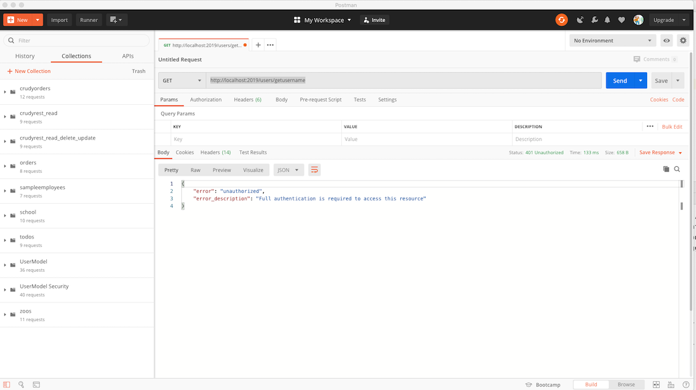

#### Oauth2 Authorization
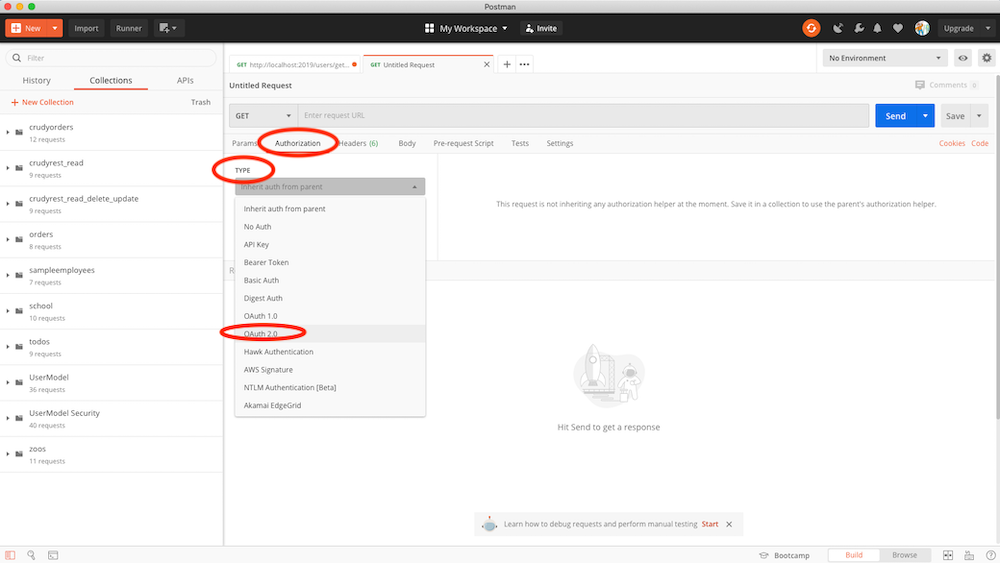

#### GetAccess Token
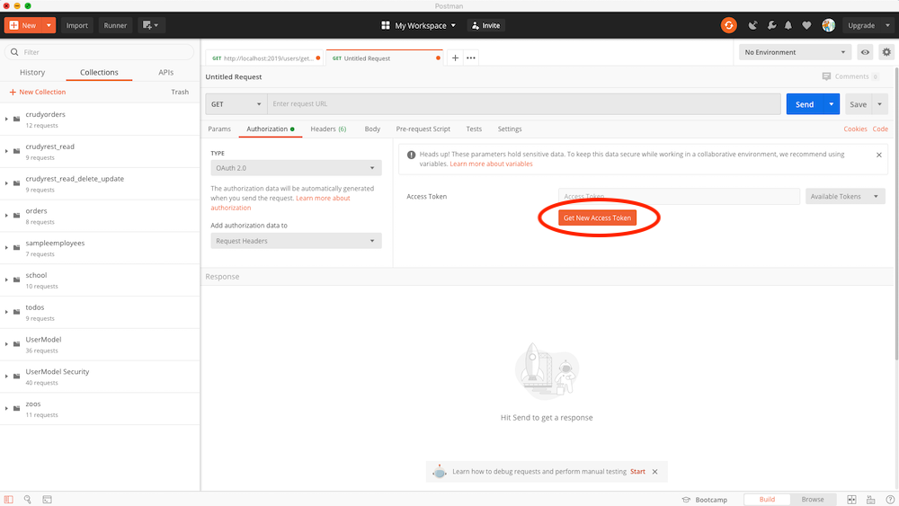

#### New Access Token Window
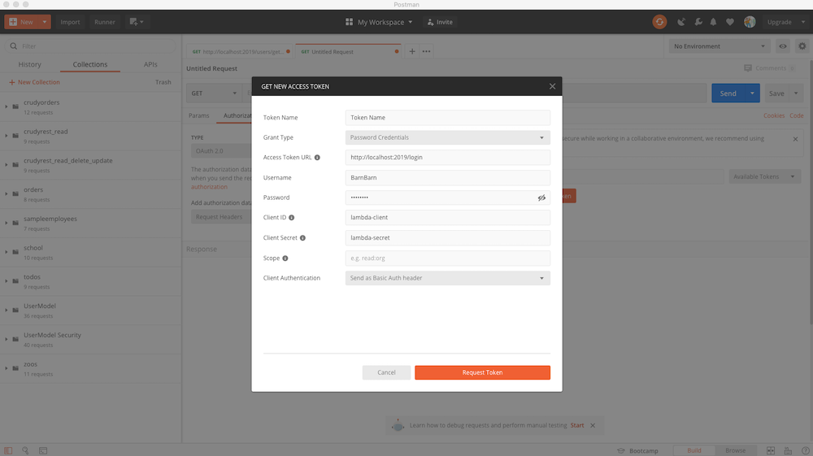


