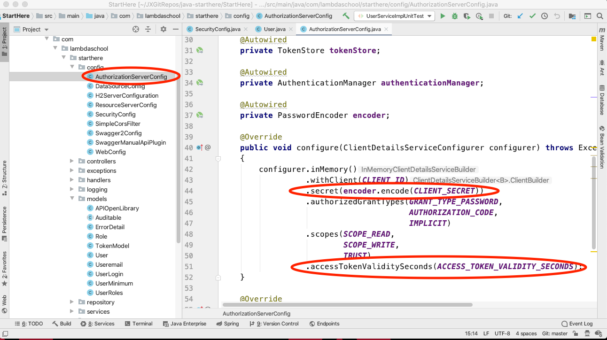

# java-oauth2

java-oauth2 initial should be the same as java-usermodel - expections and logging

### server.port
* Default port 8080, otherwise defined in resources/application.properties.

### Logging
* Under Spring boot, slf4j and LogBack are treated the same. 
* Include slf4j as dependency in pom.xml, a file logback-spring.xml can be created to control loggging output to files and console.
* slf4j enables LoggerFactory to creater logger.info.In application.properties -> server.port=${PORT:2019}

### In eclipse Project Explorer,
* If spring boot starter web is managed by maven in pom.xml, tomcat will be managed by Spring boot.
* right click the project name -> select "Run As" -> "Maven Build..."
* In the goals, enter _> spring-boot:run
* then click Run button

* If tomcat is installed in pom.xml
* goals -> tomcat:run

## Oauth2 - default in the Spring Security module

> OAuth2 is an industry standard protocol for user authentication. User authentication is the verification of what human is accessing our system. Client applications request an access token from a backend API system. Gaining an access token allows a user to access projected resources, endpoints and allows the backend system to know who that user is without the user having to provide their username and password for each transaction. Gaining this access token is done through a two step process.

* Clients must be authorized to access the system using a client user name and password, called a client id and client secret in the OAuth2 protocol. This client id and client secret could be the same for all clients who want to access the backend API, or each client could receive their own id and secret. The ids and secrets are controlled by the backend system. The backend system must tell the client what client id and client secret to use!
   - Sometimes a client will send an authorization token instead of a client id and client secret. For our purposes, this authorization token is simply the client id and client secret combined and encoded using Base64 encoding.
* After a client has been authorized, an individual user is authenticated to the system using a user name and password.

> These two steps are necessary but are usually combined into a single request from the client for an access token. After initially getting the access token, the client must send that token with each subsequent request. The access token can be used by the backend system to determine what user is accessing the system.

In the OAuth2 framework, 4 Roles are identified.

* The client
   - Often called the frontend. This is the application that wishes to access our backend API server.
* The Resource Server
   - This is our backend API server. It is the server that hosts the protected information.
* The Authorization Server
   - This is the part of the backend application that grants access tokens. Access tokens are only granted after the client is authorized and the user is authenticated. When we think of using Google, Facebook, GitHub to logon to a system, what we mean is that we are using their authorization server to get an access token. 
* The Resource Owner
   - Usually a person that grant access to a protected resource. Think something like a system admin.
   
### Roles in our code
> We will be using Spring Security to implement OAuth2. OAuth2 is the default, standard protocol implemented by Spring Security. That will make implementation easier. The implement is a series of boilerplate code that is customized to fit our applications. We will be using

* An AuthorizationServerConfig class that will serve the role of the Authorization Server. We use the @EnableAuthorizationServer annotation to set up a default authorization server and then customize it to fit our applications.
* A ResourceServerConfig class that will serve the role of the resource server. We use the @EnableResourceServer annotation to set up a default resource server and then customize it to fit our application. Most of our application is concerned with how to protect, display, and manipulate resources. So most of our application, including all that we have coded up until this point, can be considered part of the resource server.
* A SecurityConfig class that will serve as the main configuration class for our OAuth2 server. We use the @EnableWebSecurity annotation to say, yes we want to use web security and then we configure this web security to our own needs.

> Do note that the OAuth2 process as authorization or authentication. This is not correct. Those are two different parts of the OAuth2 protocol. However, in the industry often the OAuth2 protocol is referred to as authorization or authentication.

### Gaining Access
> In order to request an access token, our client needs to know the client id and client secret. These will be provided to the client by the backend administrator. It is OUR responsibility to give the frontend the client id and client secret. The frontend client does not get to choose what these are, we do. Commonly you will see these being hard to guess random characters, normally 32 character hex strings. Sometimes you will see the client id and client security provided as Base64 API access tokens. A client would use either the client id / client security combination or the API access token to get authorized to the system. They do NOT use both. Which one they use is often left to the client to decide. The format of combining the client id and client secret is to take the following and encode it using Base64:

* client id:client secret

* Client id: 6779ef20e75817d76902 Client security: 9e51c1701e1a6f5cfb30780d94d38b8d API access token: Njc3OWVmMjBlNzU4MTdkNzY5MDI6OWU1MWMxNzAxZTFhNmY1Y2ZiMzA3ODBkOTRkMzhiOGQ=

> For our purposes we will use something easy to read. This will make reviewing each other’s code much easier.

* Client id: lambda-client Client security: lambda-secret API access token: bGFtYmRhLWNsaWVudDpsYW1iZGEtc2VjcmV0

### Adding a new user
> But before we can request access to the system, we need a user set up, you know, the one requesting access!

> Adding a new user is the same as adding any other record to our database. The one additional item is that the password has to be encrypted. Although not required, encrypting the password is definitely the preferred practice! We use an encryption algorithm called BCrypt. This is fairly standard in the industry.

> We say which algorithm we are going to use in the SecurityConfig class. This is where we setup the Bean for PasswordEncoder in SecurityConfig class.

### Authorizing the client
> The step in using the API Backend is to Authorize the client, the application wanting to use the API. The client has a special username and password needed to access the backend. They also have special names.

* username => client id
* password => client secret

> These are sent to the API backend via the Authorization header in a REST API request. They can either be sent as a username and password, or as is more common an API Key. The API Key is simply the string client id:client secret encoded using Base64.

> The AuthorizationServerConfig class is responsible for handling the Authorization of the client.

* In our case we list the client id and client secret directly in the AuthorizationServerConfig allowing for only one client id, client secret combination. Some systems provide access to multiple client ids but that is a more advanced topic.
* Note that the client secret is also encrypted using BCrypt, using our encode Bean from the SecurityConfig class.
* Other configurations happen in the AuthorizationServerConfig like how long a token is valid.

